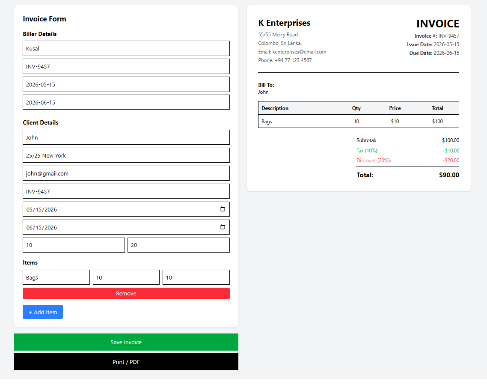
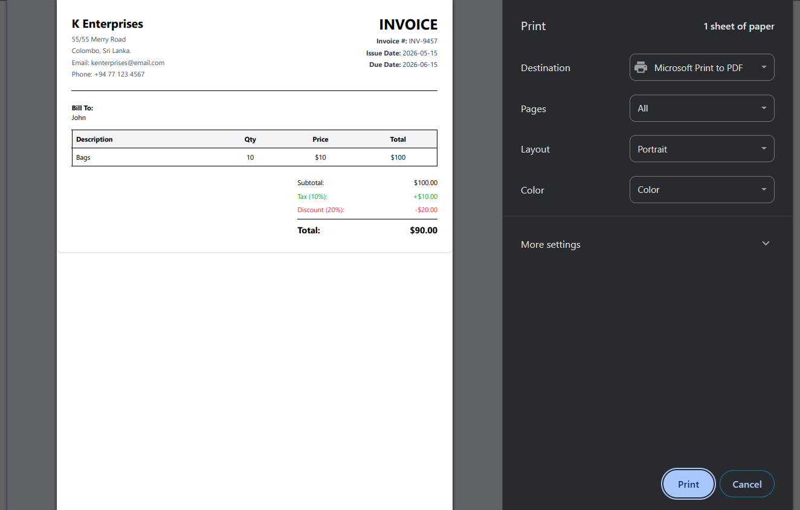

# 🧾 Invoice Management System

A full-stack invoice generator built with React, Node.js, Express, and MongoDB.

---

## 🚀 Features

- Create invoices
- Add multiple items
- Auto calculations (tax, discount, total)
- Save invoices to database
- Load & delete invoices
- Print / Export PDF

---

## 🛠 Tech Stack

Frontend:
- React
- Tailwind CSS
- Axios
- react-to-print

Backend:
- Node.js
- Express
- MongoDB
- Mongoose

---

## ⚙️ How to Run

```bash
npm install
npm run dev

##  Screenshots

###  Invoice Form


###  Invoice Preview


##  Known Limitations

Invoice number is randomly generated (rare duplicates possible)
No authentication system yet
Basic UI (can be improved to SaaS-level design)

##  Future Improvements

Add login system (JWT authentication)
Download PDF instead of print popup
Email invoice to clients
Add company logo upload
Multi-template invoice designs
Dashboard analytics

### Built by Kusal Perera